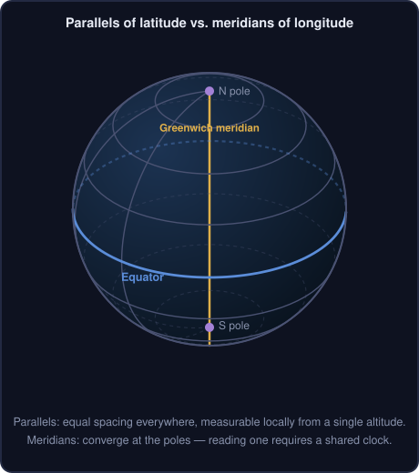
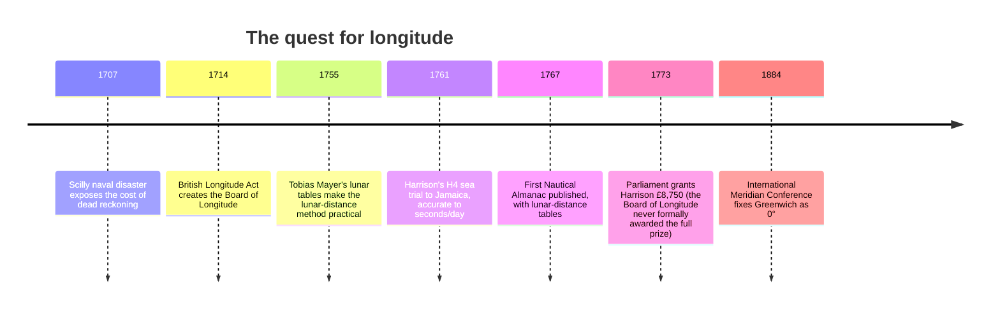
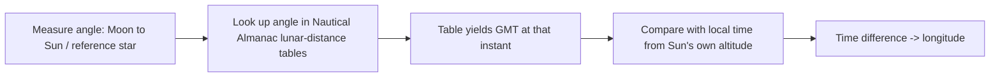
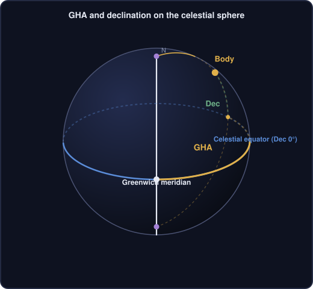
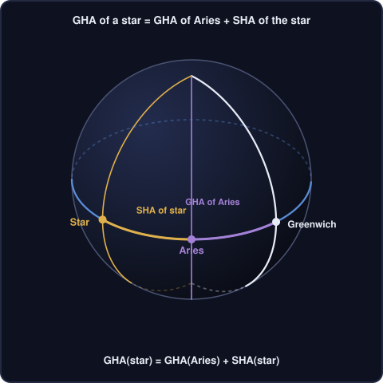
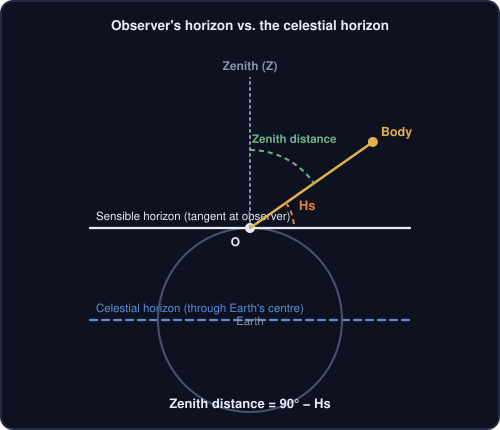
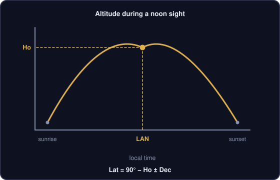
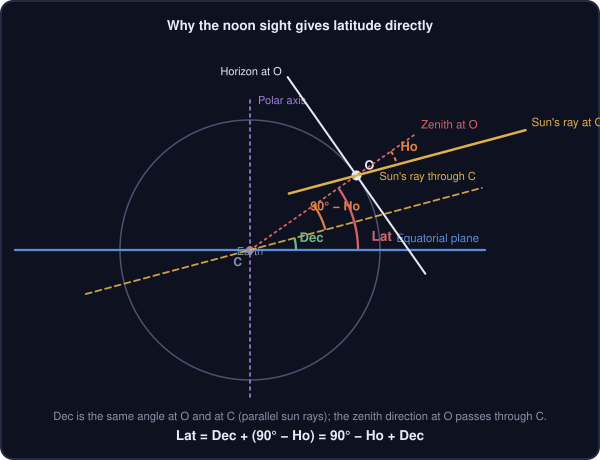
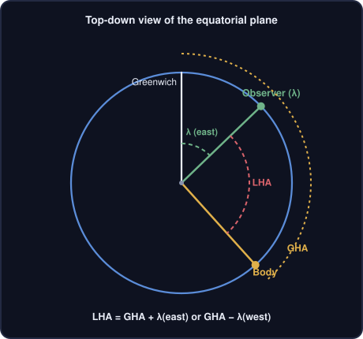

# Sight Reduction Sphere

A self-contained browser visualization for celestial navigation. The app combines a Three.js 3D globe with a compact sight-reduction panel and a plotting sheet for the intercept method.

Open `index.html` directly in a modern browser. The page loads Three.js r128 and two fonts from CDNs, so an internet connection is needed for those and for the satellite Earth imagery (also CDN-hosted); the Sun/Moon/planet textures are embedded directly in the file and always render, even offline.

## A primer on celestial navigation

The sections below build up, from first principles, the ideas the app puts on screen: a position on Earth, a position on the sky, and the spherical triangle that links them.

### 1. Latitude and longitude

Latitude is easy because it can be measured locally, with no clock at all. The altitude of the celestial pole above the horizon equals the observer's latitude, so a fixed star near the pole (Polaris, in the northern hemisphere) or the Sun's altitude at local noon, corrected for declination, gives latitude directly from a single angle measurement. Sailors and astronomers have done this since antiquity with instruments like the astrolabe, cross-staff, and later the quadrant and sextant.

Longitude has no equivalent shortcut. Because Earth rotates, "where you are east-west" is really "what time it is where you are, compared with what time it is at a reference meridian." Without an accurate reference clock, there is nothing local to measure. This is the historical "longitude problem": for centuries, ships could find their latitude precisely but their east-west position only by dead reckoning, with errors that grew every day at sea. The 1707 Scilly naval disaster, which cost roughly 1,400–2,000 lives to a longitude error, made the problem a matter of national urgency. The 1714 Longitude Act established a British Board of Longitude and a prize for a practical solution. Two rival approaches emerged: the lunar-distance method (astronomical, needing no new hardware, but demanding lengthy calculation) and the marine chronometer, a clock accurate enough to keep reference time through a long voyage at sea. John Harrison's chronometers, culminating in H4, proved the chronometer approach on sea trials in the 1760s; both methods were in active use by mariners well into the 19th century, until chronometers became affordable and lunar distances fell out of use.

The precision required is unforgiving because Earth turns a full 360° in 24 hours:

$$
1^h \rightarrow 15^\circ, \qquad 1^m \rightarrow 15', \qquad 4^s \rightarrow 1'
$$

At the equator, 1 arcminute of longitude is about 1 nautical mile. So a clock error of just 4 seconds translates to roughly a 1 nautical mile position error, and a clock drifting by only a few seconds a day can put a ship many miles off course over a multi-week Atlantic crossing — enough to miss an island or misjudge a landfall in fog.

<p align="center"></p>



### 2. Time — GMT and the Moon as a clock

Greenwich Mean Time (GMT), today formalized as Universal Time (UT), is simply the time of day on the Greenwich meridian. Every celestial-navigation calculation ultimately asks "what did the sky look like from Greenwich's meridian at the same instant the observer took a sight?" — which is why a reliable reference to GMT, however it is obtained, is the missing ingredient for longitude.

Before mechanical chronometers were trusted for long voyages, the Moon itself served as a natural clock. The Moon moves against the background stars at roughly 0.5° per hour — fast enough to notice, slow enough to measure precisely with a sextant. An observer measured the angular distance between the Moon and the Sun (or a reference star), then looked that angle up in precomputed tables — published from 1767 onward in Nevil Maskelyne's *Nautical Almanac* — which gave the corresponding GMT. Comparing that derived GMT with the observer's own local time (found from the Sun's altitude) yielded longitude, with no clock required beyond a stable local timekeeper for the duration of the sight.



### 3. Hour angle, GHA, and declination — coordinates for Sun, Moon, and planets

Just as latitude/longitude locates a point on Earth, declination/hour-angle locates a point on the sky. **Declination (Dec)** is the sky's equivalent of latitude: the angular distance of a body north or south of the celestial equator. **Greenwich Hour Angle (GHA)** is the sky's equivalent of longitude, with one key difference — it is always measured westward from the Greenwich meridian to the body's hour circle, and because Earth keeps turning, it constantly increases with time rather than staying fixed to a place on the ground.

<p align="center"></p>

GHA and Dec for the Sun, Moon, and planets change from minute to minute as the bodies orbit and Earth rotates, so this application recomputes them continuously from the current UTC time (see "Time and sidereal rotation" and "Celestial-body positions" below).

### 4. Aries, SHA, and declination — coordinates for stars

Stars are, for navigational purposes, fixed on the sky, so it is more convenient to give each one a catalog coordinate that does not change with time, then add the time-varying part separately. The reference point is the **First Point of Aries (♈)**, the direction of the vernal equinox. **Sidereal Hour Angle (SHA)** is measured westward from Aries to a star's hour circle and, like Dec, stays essentially constant for a given star. GHA of Aries carries all of the time dependence:

$$
GHA_{\text{star}} = GHA_{\Upsilon} + SHA_{\text{star}} \pmod{360^\circ}
$$

<p align="center"></p>

This is exactly the fixed-catalog approach this application uses internally, with J2000 right ascension/declination precessed to the current date (see "Stars" below).

### 5. Observed altitude, zenith distance, and the observer's two horizons

**Observed altitude (Hs)** is the angle measured with a sextant between a celestial body and the visible horizon. For the geometry of sight reduction, what actually matters is the angle from the body down to the **zenith** — the point directly overhead — called the **zenith distance**:

$$
\text{Zenith distance} = 90^\circ - Hs
$$

The subtlety is that there are two different horizons in play. The observer's real, "sensible" horizon is the plane tangent to Earth's surface at the observer's feet. The **celestial horizon** used in the geometry is a parallel plane passing through Earth's center. Because celestial bodies are so far away, the two planes point in essentially the same direction, so the distinction is negligible for the Sun, Moon, planets, and stars — the small residual (dip of the horizon, from the observer's height of eye) is corrected for separately and is not part of the spherical triangle itself.

<p align="center"></p>

### 6. The noon shot

The classic **noon sight** finds latitude without needing a longitude or even an accurate clock. As the Sun crosses the observer's meridian at **Local Apparent Noon (LAN)**, its altitude reaches a daily maximum and its azimuth flips from increasing to decreasing (roughly east-of-south to west-of-south, or the equivalent in the southern hemisphere) — an event easy to detect by simply tracking the sextant altitude and waiting for it to stop rising.

<p align="center"></p>

At that instant, latitude follows directly from the observed altitude at meridian passage (Ho) and the Sun's declination. The flat cross-section below shows why: because the Sun's rays arriving at the observer and at Earth's centre are effectively parallel, the declination angle is the same at both places, and the observer's zenith direction (extended) passes straight through Earth's centre, so the two angles simply add:

<p align="center"></p>

$$
Lat = 90^\circ - Ho \pm Dec
$$

with the sign depending on whether the observer's zenith and the Sun's declination are on the same side of the equator (same name, add) or opposite sides (contrary name, subtract), and on which pole is elevated; if Dec is greater than Ho's colatitude (declination exceeds `90 - Ho`), the observer is on the far side of the subsolar point and the formula's sense flips accordingly. This is why latitude-by-noon-sight was routine navigational practice long before the longitude problem was solved.

### 7. LHA

Everything above (GHA, Dec, SHA) is referenced to the Greenwich meridian. But the spherical triangle actually solved for a sight is built at the *observer's* meridian, so GHA must be shifted by the observer's own longitude to get the **Local Hour Angle (LHA)**:

$$
LHA = GHA + \lambda_{E} \qquad \text{or} \qquad LHA = GHA - \lambda_{W} \pmod{360^\circ}
$$

<p align="center"></p>

LHA is the angle this application ultimately feeds into sight reduction alongside declination and assumed latitude (see "Sight-reduction formulae" below); it is the true angular separation, at the observer's own meridian, between the observer and the body.

### 8. Nautical Almanac — example of the daily pages

Before calculators and apps, GHA and Dec for every hour of every day came from the *Nautical Almanac*, published annually. Each pair of facing "daily pages" covers three days and tabulates, for every whole hour of UT: the GHA of Aries, and the GHA and Dec of the Sun, Moon, Venus, Mars, Jupiter, and Saturn. A separate table at the bottom of the left-hand page lists the SHA and Dec of 57 navigational stars, which barely change over the three-day span. A representative excerpt (illustrative values, not a real date):

| UT (h) | GHA Aries | GHA Sun | Dec Sun |
|---|---|---|---|
| 00 | 180°00.0′ | 179°58.3′ | N 12°34.1′ |
| 01 | 195°02.5′ | 194°58.4′ | N 12°34.4′ |
| 02 | 210°05.0′ | 209°58.5′ | N 12°34.7′ |

| Star | SHA | Dec |
|---|---|---|
| Aldebaran | 291°17.2′ | N 16°32.6′ |
| Regulus | 207°38.9′ | N 11°55.0′ |
| Sirius | 258°45.1′ | S 16°43.1′ |

The Moon and planets also carry small **v** and **d** correction factors printed alongside their hourly GHA and Dec, because their rates of change are not perfectly uniform. For a sight taken between whole hours, the navigator looks up the minutes-and-seconds increment in a separate table (bound in yellow at the back of the almanac) and applies the `v`/`d` corrections proportionally. This application does the equivalent work continuously and exactly: `sunPosition()`, `moonPosition()`, `planetPosition()`, and the star catalog's `precessJ2000ToDate()` (see "Celestial-body positions" below) compute GHA and Dec directly from the formulas the almanac's own tables are generated from, for the precise instant selected, rather than interpolating between hourly entries.

### 9. Lunar distance — finding GMT without a chronometer

The **lunar distance method** is a historical celestial-navigation technique for determining Greenwich Mean Time (GMT) and, from it, a ship's longitude without relying on an accurate mechanical clock. The Moon moves across the background stars by roughly $0.5^\circ$ per hour, about its own apparent diameter, so it serves as the hand of a large celestial clock.

Latitude was comparatively straightforward to establish from the altitude of Polaris or the Sun. Longitude required the time at a reference meridian such as Greenwich. A lunar observation supplied that missing reference time:

1. **Observe the distance:** use a sextant to measure the angular distance between the Moon's limb and the Sun, a planet, or a bright navigational star.
2. **Clear the lunar:** convert the limb-to-body observation to a geocentric centre-to-centre distance. The calculation accounts for the Moon's semi-diameter, atmospheric refraction, and the large lunar parallax caused by observing from Earth's surface rather than its centre. The observed altitudes used in the correction workflow also require their normal sight corrections, including horizon dip where applicable.
3. **Find GMT:** compare the cleared distance with the *Nautical Almanac*'s tabulated Moon-to-body distances. The matching distance identifies the corresponding Greenwich time.
4. **Find longitude:** determine local mean time from the Sun or stars, then compare it with GMT. Earth rotates $15^\circ$ per hour, so the time difference yields longitude.

| Feature | Lunar distance method | Marine chronometer |
|---|---|---|
| Primary equipment | Sextant, *Nautical Almanac*, and calculation tables | Mechanical clock set to Greenwich time |
| Complexity | High: clearing and interpolation required substantial calculation | Low: GMT is read directly from the clock |
| 18th-century cost | Relatively accessible once a sextant and almanac were available | High: precision marine chronometers were hand-crafted instruments |
| Vulnerability | Requires a visible Moon and clear enough sky | Sensitive to wear, motion, temperature, and humidity |

Johannes Werner proposed the technique in 1514, but it became practical only in the late eighteenth century with Nevil Maskelyne's accurate ephemerides, the *Nautical Almanac* (first published in 1767), and precise sextants associated with makers such as John Bird. Lunar distances remained a major answer to the longitude problem until reliable chronometers became affordable in the nineteenth century. Radio time signals and, later, GPS displaced them for routine navigation, but the method remains an important part of deep-sea celestial-navigation practice and a valuable backup skill.

#### Clearing a lunar distance

"Clearing" a lunar distance turns the observed angular distance $D_o$, measured with a sextant from Earth's surface, into the true geocentric distance $D$ that would be seen from Earth's centre. Atmospheric refraction bends light upward and makes bodies appear higher, while lunar parallax shifts the Moon's apparent position because the observer is far from Earth's centre.

The calculation starts with five corrected or observed values:

1. **Observed lunar distance, $D_o$:** the index-error-corrected sextant angle between the Moon's limb and the Sun or reference star.
2. **Apparent Moon altitude, $h'_m$:** the Moon-centre altitude above the apparent horizon after index and dip corrections.
3. **Apparent body altitude, $h'_s$:** the Sun- or star-centre altitude after index and dip corrections.
4. **True Moon altitude, $h_m$:** the apparent altitude corrected for refraction $R$ and horizontal parallax $HP$:

$$
h_m = h'_m - R + HP \cos(h'_m)
$$

5. **True Sun/star altitude, $h_s$:** the apparent altitude corrected for refraction, with solar parallax included when required:

$$
h_s = h'_s - R
$$

In the local celestial spherical triangle, the zenith $Z$ is the apex and the apparent Moon $M'$ and body $S'$ form the base. Refraction and parallax move each body along its zenith arc, so the included zenith angle remains unchanged while the apparent positions are converted to true ones.

```text
                         Zenith (Z)
                              / \
                            /   \
            90 deg-h'm /  Z  \ 90 deg-h's
                         /       \
                Moon (M') --- Star (S')
                               D_o
```

The spherical law of cosines for the apparent triangle is

$$
\cos(D_o) = \sin(h'_m)\sin(h'_s) + \cos(h'_m)\cos(h'_s)\cos(Z)
$$

so

$$
\cos(Z) = \frac{\cos(D_o) - \sin(h'_m)\sin(h'_s)}{\cos(h'_m)\cos(h'_s)}.
$$

Applying the same law to the true altitudes gives the rigorous clearing equation:

$$
\cos(D) = \sin(h_m)\sin(h_s) + \cos(h_m)\cos(h_s)
\left[
   \frac{\cos(D_o) - \sin(h'_m)\sin(h'_s)}{\cos(h'_m)\cos(h'_s)}
\right].
$$

Historical navigators often used haversine forms, such as the Dunthorne/Young approach, because positive log-table calculations were less prone to arithmetic mistakes. With

$$
\operatorname{hav}(\theta) = \frac{1 - \cos(\theta)}{2} = \sin^2\left(\frac{\theta}{2}\right),
$$

calculate the apparent-to-true altitude changes

$$
\Delta h_m = h_m - h'_m, \qquad \Delta h_s = h_s - h'_s,
$$

then the cosine scaling factor

$$
C = \sqrt{\frac{\cos(h_m)\cos(h_s)}{\cos(h'_m)\cos(h'_s)}}.
$$

One compact haversine form is

$$
\operatorname{hav}(k) = C^2\left[\operatorname{hav}(D_o) - \operatorname{hav}(h'_m-h'_s)\right],
$$

followed by

$$
\operatorname{hav}(D) = \operatorname{hav}(h_m-h_s) + \operatorname{hav}(k),
$$

and finally

$$
D = 2\arcsin\left(\sqrt{\operatorname{hav}(D)}\right).
$$

Once the cleared distance is known, find the two *Nautical Almanac* entries that bound it. With $D_1$ and $D_2$ tabulated at times $T_1$ and $T_2$, linear interpolation gives

$$
GMT = T_1 + (T_2 - T_1)\frac{D-D_1}{D_2-D_1}.
$$

Historical lunar-distance tables commonly used three-hour intervals, making $T_2-T_1 = 3\ \text{hours}$. Comparing the recovered GMT with local mean time gives longitude at $15^\circ$ per hour. The application's Lunar Distance panel performs the geometric clearing directly, also reports almanac-style linear and cubic interpolations, and uses its ephemeris solution as the reference result.

### 10. Sight reduction tables — example

Before hand calculators, computing `Hc` and `Zn` from `Lat`, `Dec`, and `LHA` (the spherical-trigonometry formulae in "Sight-reduction formulae" below) meant either a slide rule and haversine tables, or one of the precomputed *sight reduction tables* (such as Pub. 229 or Pub. 249). These tables tabulate `Hc`, a rate-of-change factor `d`, and azimuth angle `Z` for every whole-degree combination of assumed latitude, LHA, and declination, so a navigator could look up a sight instead of computing one. An excerpt for `Lat = 40° N`, `LHA = 315°`:

| Dec | Hc | d | Z |
|---|---|---|---|
| 14° | 42°55.7′ | +40.1 | 110.4° |
| 15° | 43°35.8′ | +39.5 | 109.4° |
| 16° | 44°15.4′ | +39.0 | 108.4° |

For a declination that falls between whole degrees, the navigator interpolates: add `d × (minutes of declination / 60)` to the `Hc` from the next-lower tabulated degree, and interpolate `Z` the same way. The resulting `Hc` is then compared against the observed altitude `Ho` to get the intercept, and `Z` is converted to true azimuth `Zn` using fixed rules based on the observer's hemisphere and whether `LHA` is greater or less than 180°. `sightReduce()` in this application (see "Sight-reduction formulae" below) produces exactly this pair, `Hc` and `Zn`, directly from closed-form trigonometry for any latitude, LHA, and declination, with no tables, whole-degree rounding, or interpolation involved.

## What the application shows

- An Earth globe rendered with a real satellite photo (NASA Blue Marble), an ocean specular mask, and a normal map for surface relief, layered over a procedurally drawn vector map that shows instantly and stays as an offline-safe fallback.
- A real-time day/night terminator on Earth, driven by the actual computed Sun position, with city lights fading in on the night side.
- Real photographic textures for the Sun, Moon, and visible planets, each with a small text label; the Moon is shaded from the computed Sun direction, leaving its far side dark and revealing its phase. Unlisted bodies (stars) fall back to a flat catalog color.
- A virtual celestial sphere, equatorial plane, ecliptic plane, poles, Greenwich meridian, and starfield.
- The selected body's geographic position (GP), the observer's assumed position (AS), and the celestial zenith.
- The PZX spherical navigation triangle:
  - `P`: selected elevated pole, North or South.
  - `Z`: observer/zenith.
  - `X`: selected body's geographic position on Earth, or its corresponding celestial-sphere projection.
- Computed altitude `Hc`, true azimuth `Zn`, Greenwich hour angle `GHA`, declination, local hour angle `LHA`, and selected-body GHA/declination in the GP section.
- A circle of equal altitude drawn on the globe only when the focus body's `Hs` field contains a valid observed altitude. Its angular radius is exactly `90 - Hs`, centered on that body's GP. Visible bodies can draw independent circles from their own `Hs` fields, each in that body's palette color.
- A plotting sheet centered on the dead-reckoning position, including longitude labels, the AS-to-intercept segment, the full Zn bearing line through AS, and the focus body's LOP through the intercept, plus one additional colored LOP per visible body that has an Hs entered.
- A Lunar Distance panel for clearing a measured Moon-to-Sun or Moon-to-star distance, recovering GMT, comparing almanac interpolation with the direct solution, and applying the solved time back to the sphere.

## File architecture

`index.html` is intentionally a single-file application. It contains five layers:

1. **Markup and styling**
   - The header contains the triangle/ecliptic toggles and a kiosk-mode control.
   - The left sidebar contains navigation inputs, body selection, positions, and sight data.
   - The center viewport hosts the Three.js renderer.
   - The right panel displays the plotting sheet, GP values, and computed values.
   - The footer exposes interaction hints and the camera reset button.
   - Kiosk mode hides the sidebar, right panel, and footer, centers the viewport full-bleed, and overlays a compact readout of calculation UTC, AS position, GHA, declination, Hc, and Zn.

2. **Astronomy math**
   - Angle normalization, Julian date, and J2000 epoch helpers.
   - Approximate Sun and Moon positions.
   - A fixed navigational star catalog with J2000 right ascension and declination.
   - Low-precision orbital elements for Venus, Mars, Jupiter, and Saturn.
   - Conversion from body right ascension/declination to GHA, LHA, GP latitude, and GP longitude.
   - Spherical sight reduction for altitude and azimuth.

3. **2D/3D geometry**
   - Canvas rendering for the plotting sheet.
   - Geographic latitude/longitude to Three.js Cartesian coordinates.
   - Great-circle interpolation for spherical triangle edges.
   - Dynamic markers, labels, meridians, planes, and arcs.

4. **Application lifecycle and events**
   - `rebuildScene()` is the central recomputation and redraw routine.
   - Input changes trigger a rebuild.
   - Camera events update only the camera; astronomy data is not recomputed for camera motion.
   - A one-second interval timer advances the displayed UTC time by one second and rebuilds the scene automatically, keeping the visualization and computed values live without user input.

5. **Lunar-distance solver**
   - A self-contained ephemeris for the Moon, Sun, and navigational stars.
   - Correction for lunar semi-diameter, horizontal parallax, and atmospheric refraction before solving the geocentric distance.
   - An almanac-style distance table, linear/cubic interpolation comparison, simulated sights, and GMT recovery.

## Data flow

The main computation path is:

```text
Displayed UTC date/time
  -> Julian date
  -> GMST / GHA of Aries
  -> selected body's RA and Dec
  -> body GHA and local hour angle
  -> sight reduction using assumed latitude
  -> Hc, Zn, Z, GP latitude, GP longitude
  -> 3D markers/arcs + right-side values + plotting sheet
```

`currentJD()` converts the UTC date/time fields directly to a Julian date. Moving the time-offset slider advances or rewinds those fields by the selected relative number of hours, so the controls, viewport, and kiosk readout always show the same calculation time. `rebuildScene()` clears `dynamicGroup` and `eclipticGroup`, reads the current controls, runs this pipeline, and then rebuilds all dynamic geometry. Static scene objects such as the Earth mesh, celestial sphere, equatorial plane, lights, and starfield are created once during initialization.

## Lunar-distance workflow

Open **Lunar Distance** from the header to derive GMT from a sextant observation. The panel is prefilled from the sphere's displayed UTC time and DR position. Select the Sun or a navigational star, enter the observed Moon-to-body distance and, when available, the apparent altitudes of both bodies. The solver clears the observation to a geocentric distance using limb, semi-diameter, refraction, and parallax corrections, then searches for the corresponding GMT near the watch time.

The result includes the recovered GMT, watch error, distance rate, sensitivity of longitude to a distance error, and an almanac-style table of Moon-to-body distances. **Simulate a sight** provides a well-conditioned example; **Set sphere clock to this GMT** pauses the live sphere clock and transfers the solved time and selected body back to the visualization.

## Angle and time conventions

- Internal trigonometric functions use radians.
- User-facing angles are degrees.
- `DEG = pi / 180` converts degrees to radians.
- `RAD = 180 / pi` converts radians to degrees.
- `norm360(d)` returns an angle in `[0, 360)`.
- `norm180(d)` returns an angle in `[-180, 180]`.
- Longitude inputs use positive east and negative west.
- Latitude inputs use positive north and negative south.
- GHA is represented as a positive westward angle.
- The displayed GP longitude is `-GHA`, normalized to the `[-180, 180]` range.

## Time and sidereal rotation

### Julian date

For a JavaScript `Date`:

$$
JD = \frac{\text{milliseconds since Unix epoch}}{86\,400\,000} + 2\,440\,587.5
$$

The J2000 epoch offset is expressed in Julian centuries:

$$
T = \frac{JD - 2\,451\,545.0}{36\,525}
$$

### Greenwich mean sidereal time

`gmstDeg(jd)` uses the standard polynomial approximation:

$$
GMST = 280.46061837
+ 360.98564736629(JD - 2451545.0)
+ 0.000387933T^2
- \frac{T^3}{38\,710\,000}
$$

The result is normalized to `[0, 360)`. In this application it is treated as the Greenwich hour angle of Aries, `gha0`.

For a body's right ascension `RA`:

$$
GHA = GMST - RA
$$

For observer longitude `\lambda` (positive east):

$$
LHA = GHA + \lambda
$$

Both results are normalized with `norm360()`.

## Celestial-body positions

### Sun

`sunPosition(jd)` uses a low-precision solar model:

1. Compute the mean longitude `L0` and mean anomaly `M`.
2. Compute the equation of center:

$$
C = A_1\sin M + A_2\sin(2M) + A_3\sin(3M)
$$

3. Set true ecliptic longitude to `L0 + C`.
4. Convert ecliptic longitude to equatorial right ascension and declination using the obliquity `epsilon`:

$$
RA = \mathrm{atan2}(\cos\epsilon\sin\lambda, \cos\lambda)
$$

$$
Dec = \arcsin(\sin\epsilon\sin\lambda)
$$

The obliquity is approximated by:

$$
\epsilon = 23.439291 - 0.0130042T
$$

### Moon

`moonPosition(jd)` uses a truncated periodic model for ecliptic longitude and latitude. The principal terms are summed in degrees, then transformed to equatorial coordinates:

$$
RA = \mathrm{atan2}(\sin\lambda\cos\epsilon - \tan\beta\sin\epsilon, \cos\lambda)
$$

$$
Dec = \arcsin(\sin\beta\cos\epsilon + \cos\beta\sin\epsilon\sin\lambda)
$$

Here `lambda` is ecliptic longitude and `beta` is ecliptic latitude.

### Stars

The star catalog contains fixed J2000 right ascensions and declinations. `precessJ2000ToDate()` applies the IAU-style zeta, z, and theta precession angles:

$$
\zeta = (2306.2181T + 0.30188T^2 + 0.017998T^3)\,\text{arcsec}
$$

$$
z = (2306.2181T + 1.09468T^2 + 0.018203T^3)\,\text{arcsec}
$$

$$
\theta = (2004.3109T - 0.42665T^2 - 0.041833T^3)\,\text{arcsec}
$$

The resulting coordinates are returned as date-of-observation RA and declination. Proper motion, nutation, aberration, and refraction are not modeled.

### Planets

Planet positions use approximate Keplerian elements valid approximately for 1800-2050:

1. Linearly evaluate orbital elements from `T`.
2. Compute mean anomaly `M = L - w`.
3. Solve Kepler's equation with Newton iteration:

$$
M = E - e\sin E
$$

with update:

$$
E_{n+1} = E_n + \frac{M - (E_n - e\sin E_n)}{1 - e\cos E_n}
$$

4. Convert the orbital-plane coordinates to heliocentric ecliptic Cartesian coordinates.
5. Subtract Earth's heliocentric position to obtain geocentric coordinates.
6. Rotate by the J2000 obliquity into equatorial coordinates.
7. Convert the vector to RA and declination and apply precession.

This is intended for visualization and educational sight reduction, not precision ephemeris work.

## Sight-reduction formulae

`sightReduce(lhaDeg, decDeg, latDeg)` implements the astronomical triangle altitude equation. Let:

- `L` be assumed latitude.
- `D` be declination.
- `H` be LHA.

Then computed altitude is:

$$
\sin H_c = \sin L\sin D + \cos L\cos D\cos H
$$

The implementation clamps the inverse-trigonometric input to `[-1, 1]` to avoid floating-point domain errors.

The interior azimuth angle at the observer is computed with:

$$
\cos Z = \frac{\sin D - \sin L\sin H_c}{\cos L\cos H_c}
$$

`Z` is constrained to `[0, 180]` degrees. The true azimuth is then selected by the sign of `sin(LHA)`:

$$
Z_n =
\begin{cases}
360 - Z, & \sin(LHA) > 0\\
Z, & \sin(LHA) \le 0
\end{cases}
$$

The implementation returns `{ Hc, Zn, Z }` in degrees.

### PZX side values

For the selected elevated pole, `PZX` values displayed in the information panel are:

- `PZ`, pole-to-observer arc, or colatitude:

$$
PZ = 90 - sL
$$

- `PX`, pole-to-GP arc, or polar distance:

$$
PX = 90 - sD
$$

- `ZX`, zenith distance:

$$
ZX = 90 - H_c
$$

where `s = +1` for North and `s = -1` for South. The meridian angle display uses normalized signed LHA to add an east/west label.

## Coordinate routines

### Geographic coordinates to Three.js

`latLonToVector3(lat, lon, radius)` maps latitude/longitude to a sphere whose north pole is Three.js `+Y`:

```text
phi   = (90 - latitude) * DEG
 theta = (longitude + 180) * DEG
 x = -r * sin(phi) * cos(theta)
 y =  r * cos(phi)
 z =  r * sin(phi) * sin(theta)
```

The longitude offset and negative X sign align the Earth texture and Greenwich meridian with the scene's chosen orientation. The Earth uses `radius = 1.2`; the celestial sphere uses `radius = 3.2`.

### Great-circle interpolation

`getGreatCirclePoints(v1, v2)` normalizes the endpoints, finds the central angle `omega`, and uses spherical linear interpolation (slerp):

$$
P(t) = \frac{\sin((1-t)\omega)}{\sin\omega}P_1
     + \frac{\sin(t\omega)}{\sin\omega}P_2
$$

The result is rescaled to the requested radius. It is used for the Earth and celestial-sphere triangle edges.

### Circle of equal altitude

`getSmallCirclePoints(centerDir, angularRadiusDeg, radius)` generates a circle of constant angular distance from a center direction, rather than a great circle. It builds an orthonormal basis `(c, u, v)` around the normalized center direction and samples:

$$
P(t) = r\big(\cos R \cdot c + \sin R \cdot (\cos t \cdot u + \sin t \cdot v)\big)
$$

for `t` from `0` to `2\pi`, where `R` is the angular radius in radians. This is the true circle of equal altitude: every point on it is exactly `90 - H` degrees from the body's GP, so an observation of altitude `H` places the observer somewhere on this circle. `rebuildScene()` draws the focus-body circle only when a valid `Hs` is entered, using angular radius `90 - Hs` and the selected body's GP as its center. The focus circle is rendered as a visible overlay above the Earth surface. Visible bodies draw independent circles only when their own `Hs` is entered, centered on each body's GP.

### Ecliptic plane

The ecliptic ring is sampled at `lambda` from `0` to `360` degrees with ecliptic latitude zero. Each sample is converted to equatorial coordinates:

$$
RA_\lambda = \mathrm{atan2}(\sin\lambda\cos\epsilon, \cos\lambda)
$$

$$
Dec_\lambda = \arcsin(\sin\epsilon\sin\lambda)
$$

Those coordinates are converted to GHA/longitude with the same sidereal rotation used for celestial bodies, ensuring that the ecliptic ring shares the scene's Earth-fixed coordinate system.

## Plotting sheet

`drawPlotSheet(asLat, asLon, Zn, Hc)` draws a square covering `+-2` degrees around the DR position. The annotation pass adds longitude labels along the horizontal axis, plus a full dashed Zn bearing line through AS; the LOP remains perpendicular to that line and is labeled `LOP (Hs)`.

- Horizontal coordinate is longitude difference from DR.
- Vertical coordinate is latitude difference from DR.
- The vertical axis is inverted for canvas coordinates, so north appears upward.
- AS and DR are joined by a dashed line.

The intercept is calculated from observed altitude `Hs` and computed altitude `Hc`:

$$
a = (H_s - H_c) \times 60
$$

Because one minute of altitude corresponds to one nautical mile, `a` is in nautical miles. Positive values plot toward the selected body's azimuth; negative values plot away.

For a bearing `b` and distance `d` in nautical miles, the approximate position offset is:

$$
\Delta lat = \frac{d}{60}\cos b
$$

$$
\Delta lon = \frac{d}{60\cos(lat_{DR})}\sin b
$$

The LOP is drawn through the intercept point along the direction `Zn + 90` degrees, making it perpendicular to the azimuth.

`drawPlotSheet(asLat, asLon, Zn, Hc, bodySights)` additionally accepts a `bodySights` array built in `rebuildScene()` from every visible body with a valid Hs (each entry carries that body's own `Hc`, `Zn`, `hs`, and palette color). The same intercept/LOP math is applied per entry and rendered in the body's color with a small text label, independently of the focus body's own (green) intercept and LOP above.

The plotting sheet is a local flat approximation. It is appropriate for the small `+-2` degree window used here, but it is not a global map projection.

## Rendering model

The scene has two dynamic groups:

- `dynamicGroup` is attached to `earthGroup` and contains markers, labels, Earth arcs, the Greenwich meridian, and the celestial triangle.
- `eclipticGroup` is attached to the scene and contains the ecliptic ring and translucent fan.

On every rebuild, children in these groups are removed and recreated. This keeps the implementation straightforward and ensures that changing time, body, observer position, pole, or sight data updates every dependent visual consistently.

### Earth material

A procedural vector texture is generated once by `generateEarthTexture()` and applied immediately so the globe is never blank. Its map projection is a simple equirectangular projection:

$$
 x = (lon + 180)\frac{W}{360}, \qquad
 y = (90 - lat)\frac{H}{180}
$$

`latLonToVector3()` uses the same `(lon + 180)` / `(90 - lat)` convention, so this procedural texture and any replacement equirectangular photo align with markers and arcs without extra transforms.

Once loaded asynchronously from a CDN, three photographic maps are layered onto the same material (`earthMaterial`):

- A satellite color photo (`map`) replaces the procedural texture.
- A specular mask (`specularMap`) makes oceans glint while land stays matte.
- A normal map (`normalMap`) adds subtle surface relief under the existing Phong lighting.

`earthMaterial.onBeforeCompile` patches the stock Phong shader to add a day/night terminator: a world-space normal is compared against a `sunDirection` uniform, the lit side is left alone, the night side is dimmed, and a city-lights texture (`nightMap`) is additively blended in on the dark side only. Each `rebuildScene()` call recomputes the true sub-solar point from `sunPosition()` and updates both `sunDirection` and the scene's `sunLight` position, so the rendered terminator (and the Moon/planets' lit phase, since they share the same lighting) tracks the real Sun rather than a fixed light.

### Body markers

`addBodyMarker()` gives the Sun, Moon, and planets real photographic textures (`BODY_TEXTURE_URLS`) instead of flat-colored spheres; the Sun uses an unlit material (it is a light source), while the Moon/planets use the same Phong lighting as Earth. Bodies without a texture (stars) fall back to the flat `bodyPalette` color. Each visible/focused body also gets a small text label via `makeLabel()`.

The renderer uses a perspective camera, ambient light, a directional light (synced to the real Sun direction, see above), antialiased WebGL output, and a pixel-ratio cap of 2.

## Interaction model

- **Left drag:** orbit the camera around the scene.
- **Right drag:** pan the camera target.
- **Wheel or zoom slider:** change camera radius, clamped to `2.2..16`.
- **Reset view:** restores the initial radius, angles, and target.
- **Nav triangle toggle:** rebuilds without the Earth/celestial PZX triangle.
- **Ecliptic toggle:** rebuilds without the ecliptic ring, fan, and label.
- **Use current UTC time:** fills the date/time controls and rebuilds.
- **Use my location:** requests browser geolocation, updates AS and DR, then rebuilds.
- **Time offset range:** supports 6, 12, 48, and 72 hours, plus 1 week, 1 month, 3 months, 6 months, and 1 year.
- **Time offset slider:** advances or rewinds the displayed UTC date/time by the selected relative number of hours, then rebuilds the scene from that same displayed calculation time.
- **Visible-body Hs fields:** entering an observed altitude next to a visible body draws that body's circle of equal altitude on the globe and its line of position on the plotting sheet, colored to match the body; independent of the main "Sight Observation" Hs field for the focus body.
- **Automatic time update:** the displayed UTC time advances by one second every second, continuously updating all dependent values.
- **Kiosk mode:** toggles a full-screen presentation layout with a centered globe and an overlaid data readout; click the exit control (top right) to return to the normal layout.
- **Lunar Distance:** opens the lunar-distance sight solver. The panel can simulate a sight, calculate GMT, and set the paused sphere clock to the recovered time.

## Accuracy and scope

This is an educational visualization, not a certified navigation calculator. Important limitations include:

- Approximate solar, lunar, and planetary ephemerides.
- No topocentric parallax correction for the Moon or planets.
- No atmospheric refraction, dip, index error, semi-diameter, or observer height corrections.
- No nutation, aberration, light-time, proper motion, or detailed Earth orientation corrections.
- The star catalog coordinates are intentionally compact and approximate.
- The satellite Earth photo and Sun/Moon/planet photos are illustrative imagery, not navigational charts; the procedural vector map is a simplified fallback, not a geographic dataset.
- WebGL line width is effectively limited on many platforms, so primary triangle edges use tube geometry for visual weight.

The lunar-distance panel uses a more detailed calculation than the globe view: Meeus lunar terms, truncated VSOP87 Earth/Sun terms, stellar proper motion and aberration, plus refraction and topocentric lunar corrections. It still omits observational and instrument errors, star parallax, gravitational light deflection, unusual refraction, and the Moon's changing apparent limb near the horizon.

For real navigation, compare results with an approved nautical almanac and apply the complete sight-correction workflow.

## Imagery and licensing

- Earth's satellite photo, specular mask, normal map, and night-lights texture are NASA Blue Marble-derived assets, loaded from the `three.js` example assets on a `jsdelivr` CDN mirror.
- Sun/Moon/planet photos originate from Solar System Scope (CC BY 4.0), downscaled and embedded directly in `index.html` as base64 `data:` URIs so they render in every browser without any network request or CORS dependency.
- All photographic assets load asynchronously behind the procedural fallback texture and flat palette colors, so the app remains usable if a request fails or the page is offline.

## Extension points

The most useful places to extend the application are:

- Add a body in `getBodyRaDec()` and `populateBodySelect()`.
- Replace the low-precision ephemerides while preserving the `{ ra, dec }` return contract.
- Add correction terms before `sightReduce()` or expose corrected altitude as a separate input.
- Replace `drawPlotSheet()` with a geodesic or chart projection if the plotting area grows beyond a few degrees.
- Split the inline script into modules once the application needs automated testing or multiple views.
